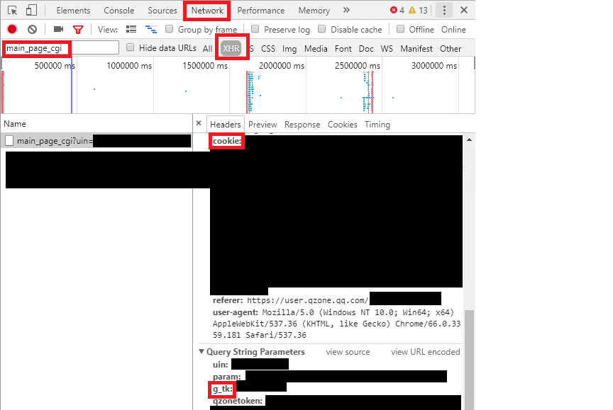
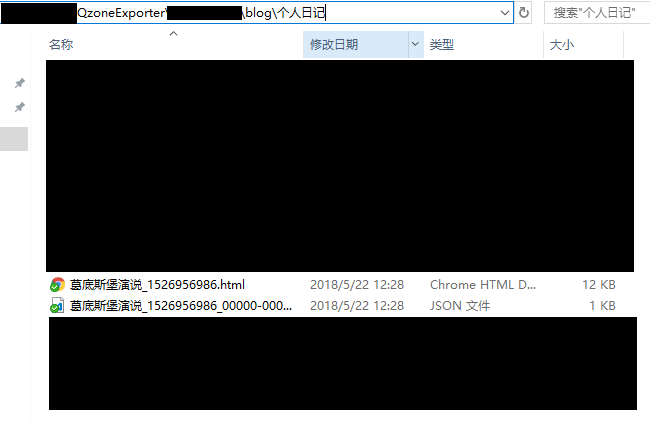
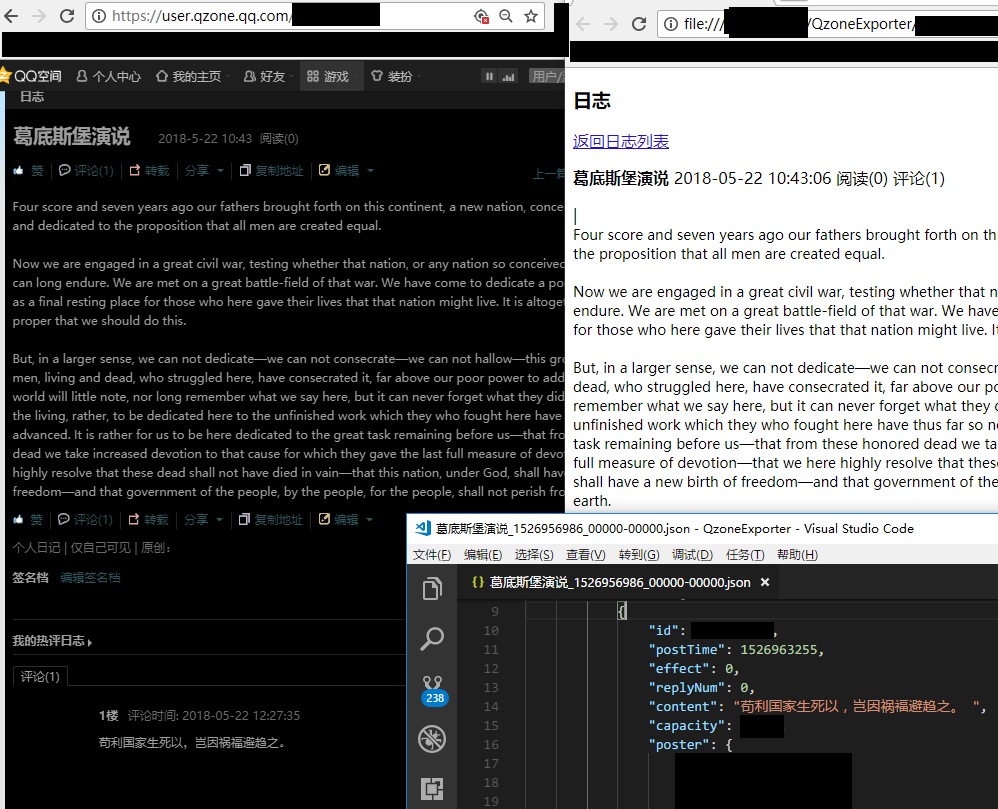
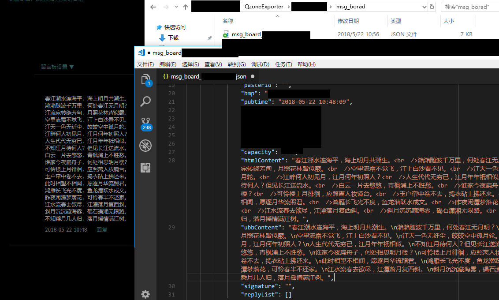

# QZoneExporter

QQ空间数据导出。

- 导出日志、留言板、相册、说说、点赞数据。
- 将说说、相册中的图片及视频下载至本地。
- 支持 Exif 信息写回照片，时间写入文件名。（由[Yang-z](https://github.com/wwwpf/QzoneExporter/pull/8)及[greysign](https://github.com/wwwpf/QzoneExporter/pull/5)提供）
- 生成html文件和将html文件打包（移步[xinyu3ru/QzoneExporter](https://github.com/xinyu3ru/QzoneExporter)）

```shell
usage: exporter.py [-h] [--blog] [--msgboard] [--photo] [--shuoshuo] [--like]
                   [--download] [--all]

optional arguments:
  -h, --help  show this help message and exit
  --blog      导出日志数据
  --msgboard  导出留言板数据
  --photo     导出相册数据
  --shuoshuo  导出说说数据
  --like      导出点赞数据，需要设置--photo或--shuoshuo
  --download  下载图片或视频至本地
  --all       导出所有数据
```

## 输入

- target_uin
  需要导出数据的QQ号
- self_uin
  用于登录空间的QQ号
- g_tk, cookies_value
  从浏览器登录QQ空间，按 `F12`，点击 `Network` 选项卡，点击QQ空间“我的主页“，点击 `XHR`，点击 `main_page_cgi` 请求，从 `Header` 中找出 `g_tk` 及 `cookie`。如图所示：
  

登录QQ需要有访问目标QQ空间的权限。

## 输出

输出的文件如下：

```plain
target_uin/
    blog/
        日志分类/             // 譬如：个人日志
            日志正文.html
            日志评论.json
    msg_board/
        每20条留言分为1个json文件
    photo
        相册名_相册id/
            downloaded/       // 保存下载的数据
            照片数据
            评论数据
        相册信息.json
        downloaded.txt        // 已下载的url
        to_download.txt       // 待下载的url及文件名
    shuoshuo/
        downloaded/
        downloaded.txt
        to_download.txt
        shuoshuo_tid.txt      // 保存说说的tid
        每40条说说分为1个json文件
    main_page.json            // 日志、相册、说说的数量
    like_information.json     // 保存点赞数据
```

### 日志





### 留言板



### 相册


### 说说


## 说明

- 数据以json格式保存，未对其进行进一步的显示，如有需要可自行处理。
- 导出的数据是登录账号可见的数据，“仅主人可见”等数据无法获取。

## 依赖

- requests
- bs4
- python3
- piexif（Exif 信息写回）

## 使用

```python
# exporter.py
# 根据需要设定以下变量
target_uin = "需要导出数据的QQ号"
self_uin = "登录空间的QQ号"
g_tk = "从浏览器获取"
cookies_value = "从浏览器获取"
q = QZoneExporter(self_uin, g_tk, cookies_value, args, target_uin)
q.export()

print("done")
```

### 示例

#### 导出日志数据

命令行中运行

```shell
python exporter.py --blog
```

#### 下载相册照片

```shell
python exporter.py --photo
python exporter.py --download
```

或

```shell
python exporter.py --photo --download
```

#### Exif 信息写回照片

具体使用参考 `photo_exif_recover.py` 内的说明。

## 存在的问题

- 某些图片通过sharpP格式传输，无法打开。
- 进度的保存。

## 参考

- [QQ 空间爬虫之爬取说说](https://kylingit.com/blog/qq-空间爬虫之爬取说说/)
  感谢这篇博客提供的思路。

## 捐赠

如果您认为该项目在一定程度上帮助了您，可以赞赏我:D


